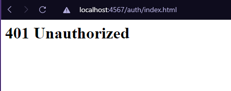

# Aplicación Distribuida Segura Por Todos Sus Frentes
Aplicación la cual se podrá acceder de manera segura por medio del protocolo HTTPS ya que permite el trafico de datos seguros mediante el protocolo SSL.

## Instrucciones de Uso

### Prerrequisitos
* git version 2.25.1
* Apache Maven versión: 4.0.0
* java versión: "1.8.0"

### Ejecución
Para poder usar el proyecto lo primero que se debe realizar es clonar el proyecto utilizando el siguiente comando desde una terminal:
```
git clone https://github.com/Desarik98/AREP-SecureConnection
```
En este repositorio se encuentran dos API, una que contiene un login seguro el cual al ingresar hará una conexión de manera segura con otro API que simplemente retornara una respuesta HTTP 200 con un saludo verificando que se hizo la conexión de manera segura.

Por lo que primero ingresaremos desde la terminal al directorio Login y para ejecutarlo utilizaremos el siguiente comando:
```
java -cp "target/classes:target/dependency/*" edu.escuelaing.arep.SparkWebApp
```

Posteriormente ingresaremos desde la terminal al directorio de HelloSecureService y para ejecutarlo sin parar la ejecución del Login ingresaremos el siguiente comando (es el mismo comando para ejecutar el Login):
```
java -cp "target/classes:target/dependency/*" edu.escuelaing.arep.SparkWebApp
```


### Pruebas de Usuario

Para comprobar su funcionamiento podremos ingresar al Login mediante el siguiente enlace:
```
https://localhost:4567/
```
y iniciar sesión con las siguientes credenciales:

```
email: d.mejia@gmail.com
password: 123456
```


Al darle click al botón de Login con las credenciales anteriormente expuestas nos llevará a la siguiente página


y para comprobar la conexión segura con el otro servidor que está corriendo por el puerto 5002, podremos observar la siguiente información 


en donde podemos observar que entramos al otro servidor, además de esto podemos encontrar que la petición fue aceptada


Para terminar, en dado caso que el usuario digite mal las credenciales aparecerá el siguiente mensaje


y también podremos intentar acceder a otro recurso como por ejemplo /auth/index.html y podremos ver que no tenemos permisos para acceder a este


## Tecnologías usadas
- Maven
- Java
- Spark
- AWS EC2

## Autor
- Daniel Alejandro Mejía Rojas - Fecha: 10/10/2021

## Licencia
This project is licensed under the Gnu General Public License - see the LICENSE file for details